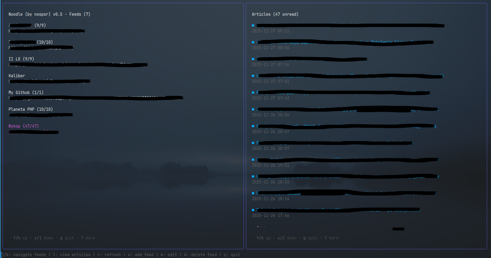
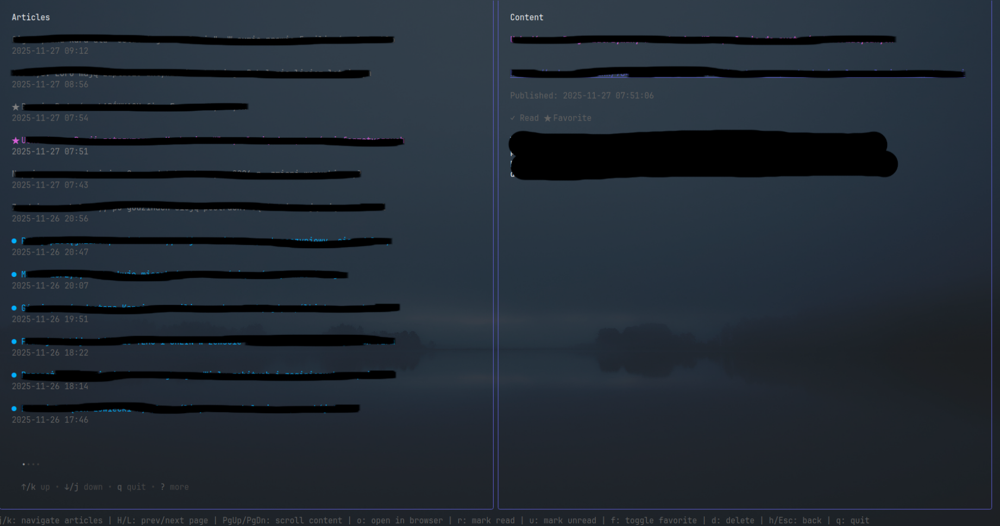

# Noodle — A Modern TUI RSS/Atom Reader

A fast and elegant RSS/Atom reader designed for people who love living in the command line. Built with Go and Bubble Tea, Noodle provides a smooth TUI experience powered entirely by your keyboard, with familiar Vim-style controls.

<p float="left">
  
  
</p>

## Features

### 🎯 Navigation & UI
- **Vim-style navigation**: Use `h`, `j`, `k`, `l` or arrow keys to navigate
- **Two-pane interface**: Feeds on the left, articles on the right
- **Article detail view**: Switch to view articles list and full content side-by-side
- **Page navigation**: Use `H`/`L` to jump to previous/next page in articles list
- **Color-coded articles**: Visual distinction between read (gray) and unread (blue) articles

### 📰 Feed Management
- **Add feeds**: Press `a` to add new RSS/Atom feeds
- **Edit feeds**: Press `e` to edit feed URL and title
- **Delete feeds**: Press `d` to delete feeds (with confirmation prompt)
- **Feed statistics**: See unread/total article counts (e.g., "Feedname (4 / 10)")
- **Auto-refresh**: Background worker automatically refreshes feeds based on config

### 📖 Article Management
- **Mark as read/unread**: Press `r` to mark read, `u` to mark unread
- **Toggle favorite**: Press `f` to star/unstar articles
- **Delete articles**: Press `x` to delete articles
- **Open in browser**: Press `o` to open article URL in your default browser
- **Auto-mark as read**: Articles automatically marked as read after viewing for configured time (default: 5 seconds)
- **Auto-mark on open**: Articles marked as read when opened in browser

### ⚙️ Configuration
- **Configurable refresh time**: Set feed refresh interval in `~/.config/noodle/config.json`
- **Configurable auto-read time**: Set `set_as_read_after` in config (default: 5 seconds)
- **Custom feed titles**: Optionally set custom titles for feeds
- **Persistent storage**: All data stored locally in SQLite database

### 🎨 User Experience
- **Immediate UI updates**: All actions (read/unread, favorite, delete) update instantly
- **Smart article filtering**: Deleted articles don't reappear after refresh
- **Timestamp-based management**: Only new articles added during refresh
- **Status indicators**: 
  - `●` for unread articles
  - `★` for favorite articles
  - Unread count shown on feeds

## Installation

```bash
# to quickly build
go build -o noodle .

# or (builds slower, but binary is smaller)
go build -trimpath -ldflags="-s -w" -o noodle .

# then run
./noodle

# you may also want to copy the binary to your PATH (and run it from any place), e.g.:
sudo cp noodle /usr/local/bin/

```

## Configuration

Configuration file: `~/.config/noodle/config.json`

```json
{
  "refresh_time": 300,
  "set_as_read_after": 5,
  "feeds": [
    {
      "url": "https://example.com/feed.xml",
      "title": "Custom Title"
    },
    {
      "url": "https://other.com/feed.xml"
    }
  ]
}
```

- `refresh_time`: Feed refresh interval in seconds (default: 60)
- `set_as_read_after`: Seconds to wait before auto-marking articles as read (default: 5)
- `feeds`: Array of feed objects with `url` (required) and `title` (optional)

## Keyboard Shortcuts

### Main View (Feeds)
- `j`/`k` or `↓`/`↑`: Navigate feeds
- `l` or `→`: Switch to article view
- `r`: Refresh selected feed
- `a`: Add new feed
- `e`: Edit selected feed
- `d`: Delete selected feed (with confirmation)
- `q` or `Ctrl+C`: Quit

### Article View
- `j`/`k` or `↓`/`↑`: Navigate articles
- `H`/`L`: Jump to previous/next page
- `PgUp`/`PgDn`: Scroll article content
- `o`: Open article in browser (auto-marks as read)
- `r`: Mark article as read
- `u`: Mark article as unread
- `f`: Toggle favorite
- `x`: Delete article
- `h`/`Esc` or `←`: Return to main view
- `q` or `Ctrl+C`: Quit

## Data Storage

- **Database**: `~/.config/noodle/noodle.db` (SQLite)
- **Config**: `~/.config/noodle/config.json`

## Dependencies

- `github.com/charmbracelet/bubbletea` - TUI framework
- `github.com/charmbracelet/bubbles` - UI components
- `github.com/charmbracelet/lipgloss` - Styling
- `github.com/mmcdole/gofeed` - RSS/Atom parser
- `github.com/mattn/go-sqlite3` - SQLite driver
- `github.com/spf13/afero` - File system abstraction

## TODO

- [ ] Keep feeds order from config

## License

Noodle is licensed under the MIT License. See [LICENSE](LICENSE) for details.

